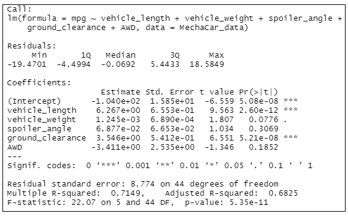
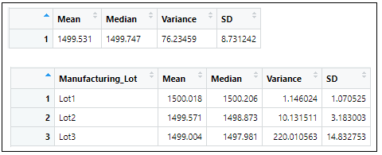
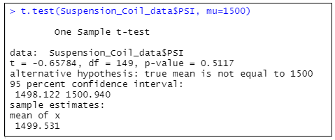
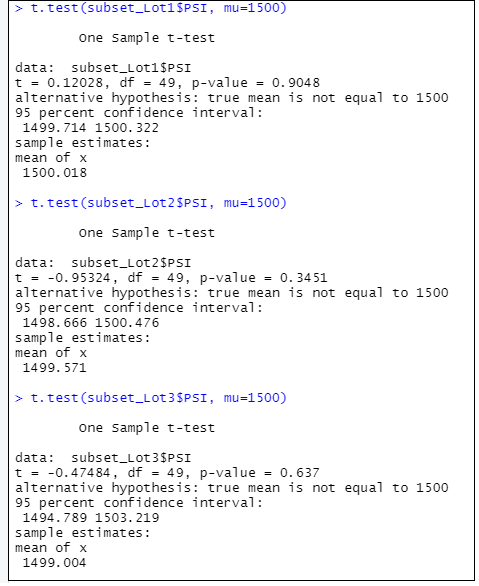

# MechaCar Statistical Analysis

## Project Overview

## Purpose of this analysis
In the past, Jeremy and I analysed some data and the management was happy.

 Now, Jeremy is approached by upper management about a special project. AutosRUs’ newest prototype, the MechaCar, is suffering from production troubles that are blocking the manufacturing team’s progress. AutosRUs’ upper management has called on Jeremy and the data analytics team to review the production data for insights that may help the manufacturing team.

## Resources
* Software/Tools: `Visual Studio Code` (v1.49.2), `RStudio` (v1.3.1093), `R` x64 3.6.3
* Language(s): R
* Data Source(s):
    * MechaCar Data: [Click Here](Resources/MechaCar_mpg.csv)
    * Suspension Coil Data: [Click Here](Resources/Suspension_Coil.csv)

## Linear Regression to Predict MPG

### Image 1: Output of Deliverable 1

### Answers to the 3 questions

* Which variables/coefficients provided a non-random amount of variance to the mpg values in the dataset?

    **Answer**: There were two variables/coefficients that provide a non-randon amount of varience to the mpg values in the dataset - `vehicle_length` & `ground_clearance`

* Is the slope of the linear model considered to be zero? Why or why not?

    **Answer**: No the slope is not Zero, since the `R-squared value is around .7149` which shows a strong co-relation.

* Does this linear model predict mpg of MechaCar prototypes effectively? Why or why not?
    
    **Answer**: Yes, the linear model predicts mpg of MechaCar Prototypes effectively because the `p-value is < 0.05`.

## Summary Statistics on Suspension Coils

### Image 2: Output of Deliverable 2

### Answer to the question

* The design specifications for the MechaCar suspension coils dictate that the variance of the suspension coils must not exceed 100 pounds per square inch. Does the current manufacturing data meet this design specification for all manufacturing lots in total and each lot individually? Why or why not?

    **Answer**: The current manufacturing data 
    1) **Does meet** the design specification for all manufacturing lots in total - since the variance of all the lots combined is 76.23, which is less than 100
    2) **Does not meet** the design specification for all manufacturing lots individually - it meets for lot 1 and lot 2, but not for lot 3, where the varience is 220 which is more than 100.

## T-Tests on Suspension Coils

### Image 3: Output of Deliverable 3 (Part 1): t-test - all lots together

### Image 4: Output of Deliverable 3 (Part 2): t-test - each lot individually

### Summary

* All lots combined: We observe the `p-value = 0.5117`. We conclude that **we cannot reject the null hypothesis**, which implies that the mean PSI of all lots combined is similar to the population mean of 1,500 pounds per inch.
* Lot 1: We observe the `p-value = 0.9048`. We conclude that **we cannot reject the null hypothesis**, which implies that the mean PSI of Lot 1 is similar to the population mean of 1,500 pounds per inch.
* Lot 2: We observe the `p-value = 0.3451`. We conclude that **we cannot reject the null hypothesis**, which implies that the mean PSI of Lot 2 is similar to the population mean of 1,500 pounds per inch.
* Lot 3: We observe the `p-value = 0.637`. We conclude that **we cannot reject the null hypothesis**, which implies that the mean PSI of Lot 3 is similar to the population mean of 1,500 pounds per inch.

## Study Design: MechaCar vs Competition
There are many metrices that a cunsumer thinks of at the time of buying a car, a few of these are:
1) Cost of the car
2) City and/or Highway Fuel efficiency
3) Seating Capacity
4) Horse Power
5) Maintenance cost
6) Safety Rating
7) Resale value

### TEST 1

* What metric or metrics are you going to test?
    * For the purpose of test 2, we are going to test **Maintenance Cost**
* What is the null hypothesis or alternative hypothesis?    
    * Null Hypothesis (Ho): There is no statistical difference between the **Maintenance Cost** of MechaCar and the competition
    * Alternate Hypothesis (Ha): There is a statistical difference between the **Maintenance Cost** of MechaCar and the competition

* What statistical test would you use to test the hypothesis? And why?
    * We would use a **two-sample t-test**, as this will allow us to compare a random sample of MechaCar's **Maintenance Cost** against a random sample of the competition's **Maintenance Cost**

* What data is needed to run the statistical test?
    * We would need completely radom samples of **Maintenance Cost** of MechaCar and the competition. 

### TEST 2

* What metric or metrics are you going to test?
    * For the purpose of test 1, we are going to test **City Fuel Efficiency**
* What is the null hypothesis or alternative hypothesis?    
    * Null Hypothesis (Ho): There is no statistical difference between the **City Fuel Efficiency** of MechaCar and the competition
    * Alternate Hypothesis (Ha): There is a statistical difference between the **City Fuel Efficiency** of MechaCar and the competition

* What statistical test would you use to test the hypothesis? And why?
    * We would use a **two-sample t-test**, as this will allow us to compare a random sample of MechaCar's **City Fuel Efficiency** against a random sample of the competition's **City Fuel Efficiency**

* What data is needed to run the statistical test?
    * We would need completely radom samples of '**City Fuel Efficiency**' of MechaCar and the competition.    